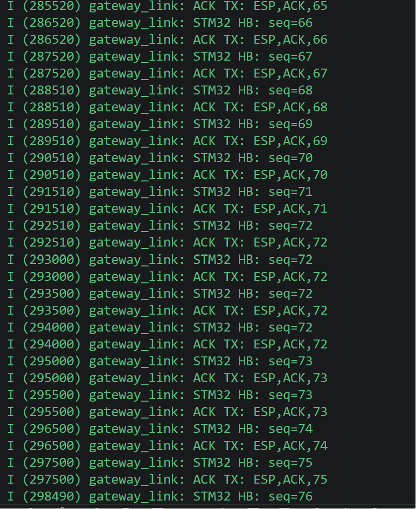
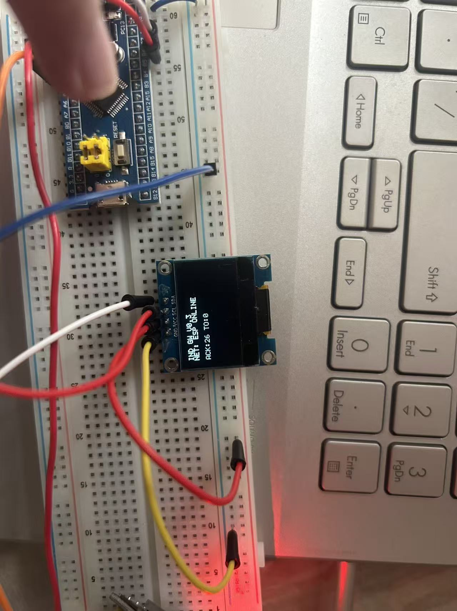

# 实验流程 v0.3：序号确认与超时重传

## 目标

在 v0.2 双向 ACK 的基础上，验证网关串口协议具备帧序号、匹配确认、超时和重传能力。

## 协议

| 方向 | 帧格式 | 说明 |
|---|---|---|
| STM32 -> ESP32 | `GW,HB,<seq>\r\n` | 心跳帧，`seq` 为 1 到 65535 的序号 |
| ESP32 -> STM32 | `ESP,ACK,<seq>\r\n` | ACK 必须携带相同序号 |

## 状态机

1. STM32 每隔 1 秒发起一个新序号的心跳。
2. STM32 进入等待 ACK 状态，500 ms 内未收到匹配 ACK 则重发同一序号。
3. 最多重传 3 次；仍无 ACK 时累计一次超时，并进入下一轮心跳。
4. 只有序号匹配的 ACK 才能让链路判定在线。
5. 连续 3 秒未收到有效 ACK，STM32 板载 LED 快闪；收到有效 ACK 后慢闪。

## 验证步骤

1. Keil 打开 `MDK-ARM/industrial_gateway.uvprojx`，F7 编译、F8 下载 STM32。
2. VS Code 打开 `esp32_gateway`，使用 ESP-IDF 扩展重新构建、烧录、打开 Monitor。
3. 正常接线下，Monitor 应反复显示：

   ```text
   STM32 HB: seq=1
   ACK TX: ESP,ACK,1
   STM32 HB: seq=2
   ACK TX: ESP,ACK,2
   ```

4. 临时拔掉 STM32 PA3 -> ESP32 GPIO17 一根线，等待约 3 秒：STM32 应判定超时并快闪。
5. 重新接回 PA3 -> GPIO17：LED 应恢复慢闪，OLED（已接入时）显示在线和 ACK/超时统计。

## 实测记录

| 项目 | 记录 |
|---|---|
| 实验日期与操作者 | 2026-07-18；操作者未记录 |
| STM32 固件版本/构建时间 | v0.3；构建时间未记录 |
| ESP32 固件版本/构建时间 | v0.3；构建时间未记录 |
| ESP32 串口号 | 未记录 |
| 拔线前连续 ACK 序号 | `1087`～`1091`，约每 1 s 递增；每帧均有匹配 `ACK TX` |
| 拔线后重复的心跳序号 | `1091`、`1092`、`1093`、`1094`；后续还记录到 `1187`～`1212` 等重复序号 |
| 同一序号发送次数 | `1091`、`1092`、`1093`、`1094` 各 4 次，间隔约 500 ms；符合首次发送 + 3 次重传 |
| STM32 LED 是否在约 3 s 后快闪 | 未观察；不作为本次串口协议判定依据 |
| OLED 的 ACK/TO 计数 | 未观察 |
| 复线后首个恢复 ACK 序号 | `1097`（日志从 `1096` 的重传阶段恢复为每约 1 s 一次的新序号） |
| 复线后 LED 是否恢复慢闪 | 未观察；不作为本次串口协议判定依据 |
| 异常、照片或日志文件路径 | ESP32 Monitor 原始日志：`pasted-text.txt`（本次对话附件） |

## 通过判定与结论

满足以下全部条件，才可在此处记录“v0.3 超时重传实验通过”：

1. 拔线前，ESP32 Monitor 连续显示递增的 `STM32 HB: seq=N` 及对应 `ACK TX: ESP,ACK,N`。
2. 拔除 **PA3 -> GPIO17** 后，Monitor 对同一 `seq` 显示 4 次心跳（首次发送加最多 3 次重传）；由于 ACK 线路断开，ESP32 仍会打印 ACK 发送日志，但 STM32 收不到 ACK。
3. 超过约 3 s 后，STM32 板载 LED 进入快闪，OLED（如已连接）显示离线/重传状态且 `TO` 计数增加。
4. 复线后，ESP32 收到后续心跳并打印 ACK；STM32 在收到匹配 ACK 后恢复慢闪。

## 实验依据与现场说明

### 图 1：ESP32 Monitor 的超时重传记录



图中 `seq=65` 到 `seq=71` 均按约 1 s 递增，且每次 `STM32 HB` 后紧跟同序号的 `ACK TX`，说明双向链路正常。

从 `seq=72` 开始，同一心跳在 `292510`、`293000`、`293500`、`294000` ms 被 ESP32 连续接收 4 次，间隔约 500 ms。ESP32 每次都打印 `ACK TX: ESP,ACK,72`，但 STM32 未收到这些 ACK，因此按策略继续重传；这正是断开 **PA3 -> GPIO17**（ESP32 ACK 到 STM32 的回传线）时应出现的现象。随后 `seq=73` 继续按同样规则重传，证明超时重传状态机持续工作。

### 图 2：STM32 OLED 本地状态页



OLED 显示内容含义如下：

| 显示文本 | 含义 |
|---|---|
| `IND GW V0.3` | 当前运行工业网关 v0.3 固件。 |
| `NET: ESP ONLINE` | STM32 在最近 3 个心跳周期内收到过有效且序号匹配的 ESP32 ACK，链路被判定为在线。 |
| `ACK:26` | 自本次启动以来，STM32 已确认收到 26 帧匹配 ACK。 |
| `TO:0` | 自本次启动以来，尚未发生“3 次重传后仍未收到 ACK”的完整超时事件。 |

该照片同时记录了 Blue Pill（STM32F103C8T6）、0.96 英寸 I2C OLED 与面包板接线的现场状态。OLED 是 STM32 侧的辅助可视化证据；协议通过判定仍以心跳序号、匹配 ACK 和重传时序为准。

**本次实验结论：通过。**

ESP32 Monitor 显示，正常状态下心跳序号每约 1 s 递增，且 ESP32 针对每帧发送同序号 ACK。断开 STM32 PA3 接收 ACK 的回传路径后，同一序号以约 500 ms 间隔连续出现 4 次；这与 STM32 的“首次发送 + 最多 3 次重传”设计一致。日志中还存在 `1096`、`1213` 之后恢复为每约 1 s 递增的新序号的区段，证明回传链路恢复后 STM32 能再次收到匹配 ACK。本次结论仅覆盖串口协议与重传行为；LED/OLED 状态指示未纳入验证。

## 注意

- 两块板仍分别用 USB 供电，只连接 PA2、PA3、GND 三根通信线。
- 如果复制后的 ESP-IDF 工程提示 build 目录指向旧路径，请在 VS Code 的 ESP-IDF 菜单执行 **Full Clean**，然后重新构建；不要删除原 C 盘工程。
