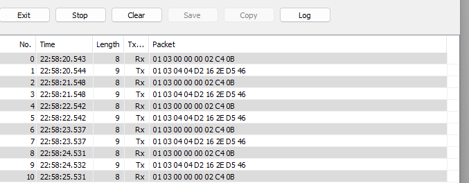
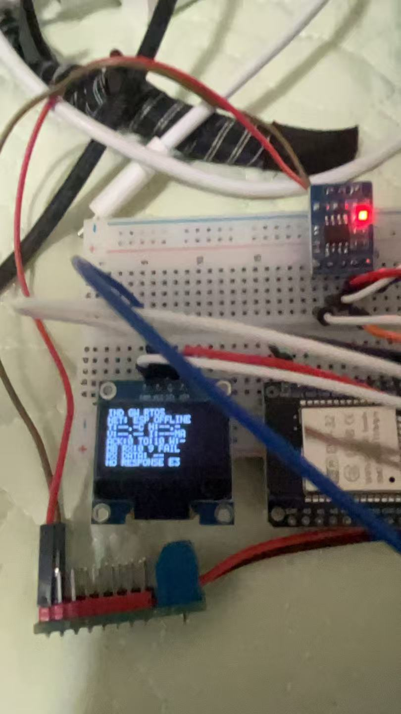

# 实验记录 v0.8：Modbus RTU 收发可视化

## 实验日期

2026-08-03

## 实验目的

使用电脑端 Modbus Slave 作为 1 号从站，验证 STM32 能否通过 3.3 V RS485 收发模块读取地址 0 和地址 1 的两个保持寄存器，并通过 OLED 直接显示实际接收情况。

## 实验配置

- 通信模式：Modbus RTU
- 串口参数：9600、8N1
- 从站地址：1
- 功能码：03（读取保持寄存器）
- 起始地址：0
- 寄存器数量：2
- 地址 0 的测试值：1234（`0x04D2`）
- 地址 1 的测试值：5678（`0x162E`）
- STM32 请求帧：`01 03 00 00 00 02 C4 0B`
- 期望响应长度：9 字节

## OLED 可视化改动

OLED 最下面三行改为显示：

1. 本轮实际接收字节数/期望字节数以及成功或失败；
2. 已收到的前五个原始十六进制字节；
3. 成功时显示寄存器值，失败时显示无响应或部分响应。

完整成功示例：

```text
MB RX:9/9 OK
RX:01 03 04 04 D2
R0:1234 R1:5678
```

## 测试记录

电脑端持续收到 STM32 发出的 8 字节请求，并发送9字节响应：

```text
请求：01 03 00 00 00 02 C4 0B
响应：01 03 04 04 D2 16 2E D5 46
```

其中 `04 D2` 对应十进制 1234，`16 2E` 对应十进制 5678。电脑端通信记录如下：



同一次实验中，OLED 稳定显示：

```text
MB RX:0/9 FAIL
RX DATA: --
NO RESPONSE E3
```

OLED 实拍如下：



## 实验结论

1. STM32 发出的 Modbus 请求能够经过 RS485 总线完整到达电脑端。
2. 电脑端能够根据请求生成并发送格式正确、包含 1234 和 5678 的9字节响应。
3. 本次照片对应的 STM32 轮询周期实际收到 `0/9` 字节，因此没有完成响应解析，Modbus端到端读取实验暂未通过。
4. 本记录只描述已观察到的链路现象，不能仅凭该结果判定 RS485 模块损坏。
5. OLED 原始字节可视化功能已经生效，后续实验可直接用 `实际字节数/9` 和 `RX` 原始数据判断接收情况。

