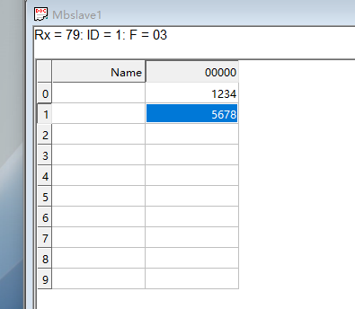
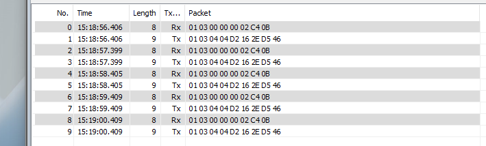
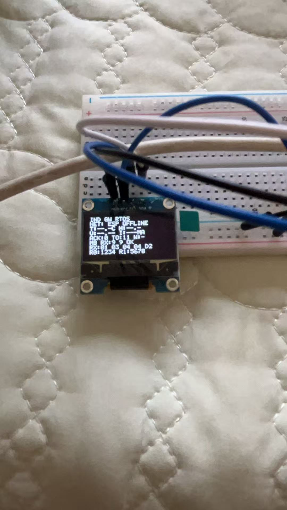

# 实验记录 v0.9：Modbus RTU 端到端读取成功

## 实验日期

2026-08-05

## 实验目的

使用 STM32F103C8T6 作为 Modbus RTU 主站，通过 3.3 V RS485 收发模块访问电脑端模拟从站，验证请求发送、从站应答、STM32响应解析以及OLED本地显示的完整链路。

## 硬件与软件

- STM32F103C8T6（运行FreeRTOS网关程序）；
- 3.3 V RS485收发模块；
- USB转RS485模块；
- SSD1306 I2C OLED；
- 电脑端 Modbus Slave 软件。

## 关键接线

| STM32/设备 | 连接目标 |
|---|---|
| PA9 / USART1 TX | RS485模块 RXD |
| PA10 / USART1 RX | RS485模块 TXD |
| PB1 | RS485模块 EN |
| 3.3V | RS485模块 VCC |
| GND | RS485模块 GND及USB转RS485 GND |
| RS485模块 A | USB转RS485 A |
| RS485模块 B | USB转RS485 B |
| PB6 / I2C1 SCL | OLED SCL |
| PB7 / I2C1 SDA | OLED SDA |

> 关键经验：PA9是STM32发送端，必须连接收发模块的RXD；PA10是STM32接收端，必须连接收发模块的TXD。

## 通信参数

- 模式：Modbus RTU；
- 波特率：9600 bit/s；
- 数据格式：8N1；
- 从站地址：1；
- 功能码：03（读取保持寄存器）；
- 起始地址：0；
- 寄存器数量：2；
- 地址0：1234（`0x04D2`）；
- 地址1：5678（`0x162E`）；
- 轮询周期：约1秒。

## 实验流程

1. 断电完成STM32、RS485模块、USB转RS485和OLED接线。
2. 在电脑端选择USB转RS485对应串口，设置RTU、9600、8N1。
3. 将从站地址设置为1，保持寄存器0和1分别填写1234、5678。
4. 给STM32上电并运行FreeRTOS网关程序。
5. 观察电脑端接收计数、通信流量窗口和OLED显示。

## 测试记录

### 1. 电脑端从站持续收到请求

Modbus Slave界面显示：

- `Rx = 79`，接收计数持续增长；
- `ID = 1`；
- `F = 03`；
- 保持寄存器0为1234；
- 保持寄存器1为5678。



### 2. 请求与响应帧连续配对

通信流量窗口中，请求帧和响应帧约每秒成对出现：

```text
主站请求（8字节）：01 03 00 00 00 02 C4 0B
从站响应（9字节）：01 03 04 04 D2 16 2E D5 46
```

响应数据中的 `04 D2` 对应十进制1234，`16 2E` 对应十进制5678。



### 3. STM32成功解析并显示响应

OLED显示：

```text
MB RX:9/9 OK
RX:01 03 04 04 D2
R0:1234 R1:5678
```

这表明STM32收到了完整9字节响应，通过了地址、功能码、字节数和CRC检查，并正确解析了两个16位保持寄存器。

画面中的 `NET: ESP OFFLINE` 仅表示本次实验未接入ESP32，不影响Modbus RTU实验结论。



## 实验结论

本次实验通过，已完成以下端到端验证：

1. STM32能够周期生成并发送正确的功能码03请求；
2. RS485物理链路能够把请求传送到电脑端从站；
3. 电脑端从站能够返回包含1234和5678的正确响应；
4. STM32能够接收完整响应、校验协议并解析寄存器；
5. OLED能够直观显示接收字节数、原始数据和最终寄存器值。

因此，项目的 `USART1 + RS485 + Modbus RTU主站轮询` 功能已经完成真实硬件验证，可在README、GitHub项目说明和后续博客中标记为“实机实验通过”。

## 与前序实验的关系

- STM32与ESP32心跳、ACK和超时重传验证了网关内部双控制器链路；
- 本次Modbus RTU实验验证了网关面向工业现场设备的RS485采集链路；
- 两项实验共同构成当前工业网关“下接现场设备、上接网络协处理器”的核心通信基础。
