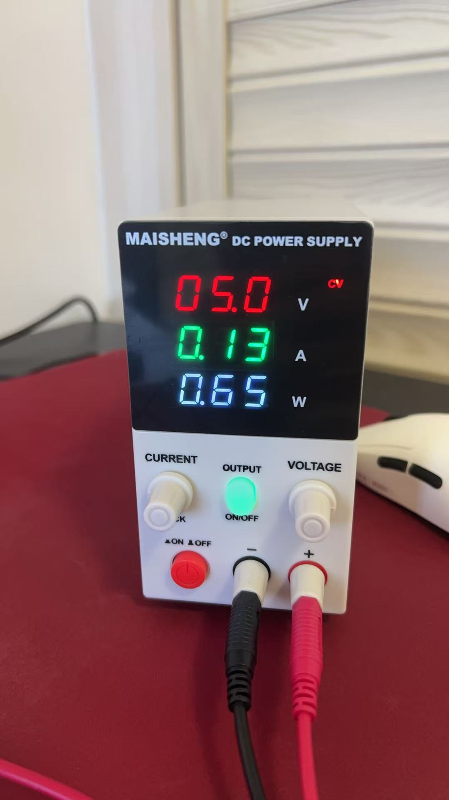
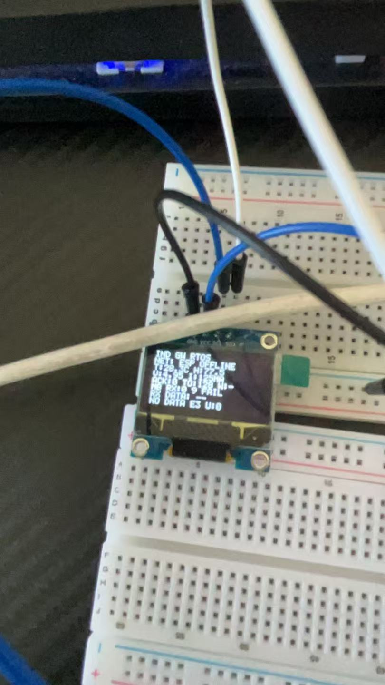
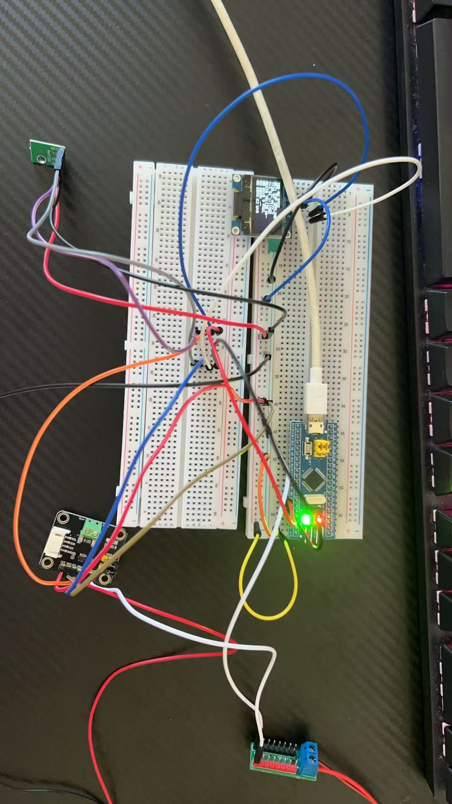
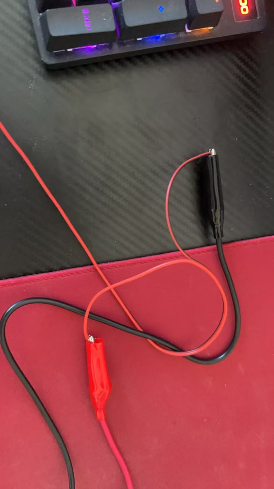

# 实验记录 v1.0：AHT20、INA219与5V风扇负载测量

## 实验日期

2026-08-06

## 实验目的

在STM32 FreeRTOS工业网关上同时接入AHT20、INA219和SSD1306 OLED，以5V无刷风扇作为真实负载，验证：

1. 多个I2C设备共享PB6/PB7总线；
2. AHT20能够采集环境温湿度；
3. INA219能够测量风扇供电电压、电流和功率；
4. OLED能够持续显示本地采集状态；
5. 系统在风扇持续运行时保持稳定。

## 实验硬件

- STM32F103C8T6；
- SSD1306 I2C OLED；
- AHT20温湿度传感器；
- INA219电压/电流/功率检测模块；
- DC 5V 4010两线无刷风扇；
- 可调直流电源；
- 面包板、杜邦线和导线转杜邦线模块。

## I2C接线

OLED、AHT20和INA219并联在I2C1总线上：

| STM32 | OLED | AHT20 | INA219 |
|---|---|---|---|
| 3.3V | VCC | VIN/VCC | VCC |
| GND | GND | GND | GND |
| PB6 / SCL | SCL | SCL | SCL |
| PB7 / SDA | SDA | SDA | SDA |

三个模块共用SCL、SDA、3.3V和GND，但各自使用不同I2C地址，因此能够同时工作。

## INA219与风扇供电接线

INA219串联在风扇正极供电线路中：

```text
可调电源正极 → INA219 VIN+ → INA219 VIN- → 风扇红线
风扇黑线 → 公共GND → 可调电源负极
```

公共GND同时连接STM32、OLED、AHT20、INA219和可调电源负极。`VIN-`是采样电阻后的负载正极，不是电源负极。

## 电源设置

- 输出电压：5.0V；
- 电流上限：0.25A；
- 实际工作模式：CV恒压；
- 实际工作电流：0.13A；
- 实际输出功率：0.65W。

电源显示满足：

```text
5.0V × 0.13A = 0.65W
```

说明电源端电压、电流和功率三项数据相互吻合。



## 实验流程

1. 保持可调电源OUTPUT关闭，并断开STM32供电。
2. 完成OLED、AHT20和INA219的I2C并联接线。
3. 将INA219串联到5V风扇正极供电回路，并完成公共地连接。
4. 给STM32上电，确认OLED启动。
5. 将可调电源设置为5.0V、0.25A限流。
6. 打开OUTPUT，观察风扇启动、电源显示及OLED采集结果。
7. 持续运行约10分钟，观察停转、异常发热、系统复位和数据显示异常。

## 测试记录

### 1. 电源与风扇负载

打开OUTPUT后风扇正常启动并持续转动。可调电源稳定保持CV模式，显示5.0V、0.13A、0.65W，没有进入持续限流状态。

### 2. AHT20与INA219本地采集

OLED上的温湿度、电压和电流字段由未接模块时的占位状态更新为实际数值，证明AHT20和INA219均已被STM32识别并参与周期采集。由于本次OLED照片焦点和导线遮挡影响，记录不强行转录无法可靠辨认的末位数值，保留原始照片作为证据，并以电源正面读数作为本次负载的量化参考。

OLED中的 `NET: ESP OFFLINE` 是因为本次没有接入ESP32；Modbus离线/无数据状态是因为本次没有连接RS485从站，均不影响AHT20和INA219实验结论。



### 3. 整体接线

整体接线照片包含STM32、OLED、AHT20、INA219、面包板、风扇供电线路以及电源转接部分，可用于后续复现和排查。



鳄鱼夹与转接导线保持分离，用于将可调电源接入低压负载回路。



### 4. 稳定性

用户报告系统连续运行约10分钟，期间现象正常。风扇持续运行，电源保持CV模式，未报告停转、异常发热、STM32复位或OLED显示中断。

## 实验结论

本次实验通过：

1. OLED、AHT20和INA219能够共享STM32 I2C1总线；
2. AHT20温湿度采集链路完成真实硬件验证；
3. INA219能够对5V风扇负载进行在线电量采集；
4. 5V风扇在约0.13A、0.65W条件下稳定运行；
5. STM32 FreeRTOS网关在多I2C设备和真实负载接入后连续运行约10分钟未见异常。

因此，项目中的AHT20与INA219功能可从“代码已实现”更新为“实机实验通过”。后续可以继续进行风扇启动瞬态、不同电压工况、长时间稳定性以及INA219与外部仪表的精度对比实验。
