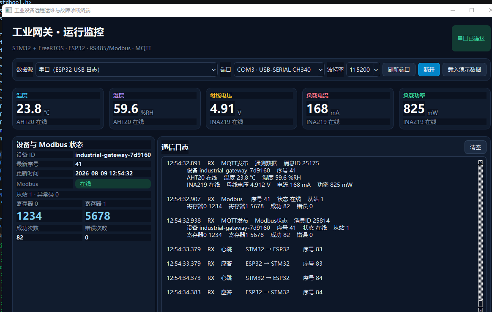

# 实验记录 v1.2：Qt上位机端到端监控

## 实验日期

2026-08-09

## 实验目的

将已经分别验证的传感器采集、Modbus RTU、STM32与ESP32串口通信、Wi-Fi/MQTT和Qt上位机整合运行，验证工业网关从现场采集到电脑端可视化的完整链路。

## 系统链路

```text
电脑Modbus Slave
       │ USB转RS485 / Modbus RTU 9600 8N1
       ▼
STM32F103C8T6 + FreeRTOS
       ├── I2C：AHT20、INA219、OLED
       └── UART：心跳、ACK、传感器和Modbus数据
              ▼
           ESP32
              ├── Wi-Fi / MQTT
              └── USB串口 115200
                     ▼
               Qt 6上位机
```

## 本次关键配置

### Modbus RTU

- STM32角色：主站；
- 电脑Modbus Slave：从站；
- 从站地址：1；
- 功能码：03；
- 波特率：9600 bit/s；
- 数据格式：8N1；
- 保持寄存器0：1234；
- 保持寄存器1：5678。

### Qt上位机

- 数据源：ESP32 USB日志串口；
- 串口：COM3（USB-SERIAL CH340）；
- 波特率：115200 bit/s；
- 日志已转换为中文分组格式，隐藏ESP-IDF颜色控制符和原始JSON引号。

## 实验流程

1. 断电完成STM32、3.3V RS485模块和USB转RS485接线，并连接公共地；
2. 在电脑Modbus Slave中配置从站1、功能码03和两个保持寄存器；
3. 启动Modbus Slave串口连接；
4. 给STM32、ESP32和5V风扇负载上电；
5. 按下STM32复位键，使统计计数从本次实验重新开始；
6. 退出ESP-IDF Monitor，释放ESP32串口；
7. 启动Qt上位机，使用COM3、115200连接ESP32；
8. 观察传感器、Modbus、心跳、ACK和MQTT发布状态。

## 测试结果

Qt界面在同一时刻显示：

| 项目 | 实测值 | 状态 |
|---|---:|---|
| 温度 | 23.8 °C | AHT20在线 |
| 湿度 | 59.6 %RH | AHT20在线 |
| 母线电压 | 4.91 V | INA219在线 |
| 负载电流 | 168 mA | INA219在线 |
| 负载功率 | 825 mW | INA219在线 |
| Modbus从站 | 地址1 | 在线、异常码0 |
| 保持寄存器0 | 1234 | 正确 |
| 保持寄存器1 | 5678 | 正确 |
| Modbus成功次数 | 82 | 持续增加 |
| Modbus错误次数 | 0 | 无错误 |

功率关系满足：

```text
4.91 V × 0.168 A = 0.82488 W ≈ 825 mW
```

因此INA219显示的电压、电流与功率互相吻合。

通信日志同时显示：

- MQTT遥测数据发布；
- MQTT Modbus状态发布；
- Modbus在线、从站1、寄存器1234和5678；
- STM32到ESP32的心跳序号连续增加；
- ESP32对每个心跳序号返回对应ACK。



## 实验结论

本次端到端实验通过。项目已完成以下闭环：

1. STM32通过I2C采集环境和负载电量数据；
2. STM32通过RS485/Modbus RTU读取电脑模拟从站；
3. STM32通过UART将数据发送给ESP32，并获得逐帧ACK；
4. ESP32生成MQTT遥测与Modbus消息；
5. Qt上位机通过ESP32 USB串口实时解析并展示全部关键数据；
6. Modbus成功次数持续增加且错误次数为0。

该结果可以作为GitHub README、项目演示视频、简历项目描述及技术博客中的完整系统运行证据。
