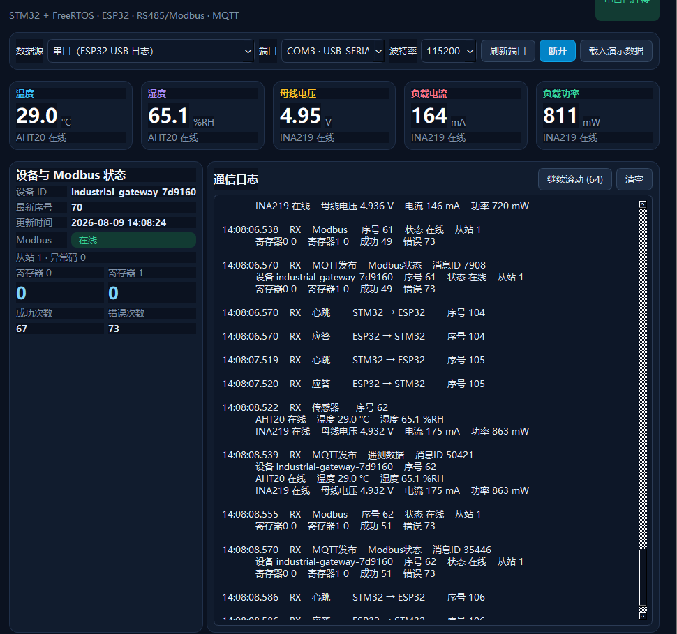
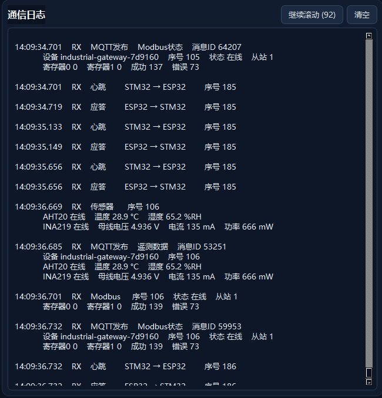
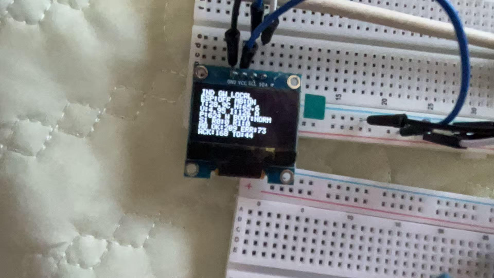
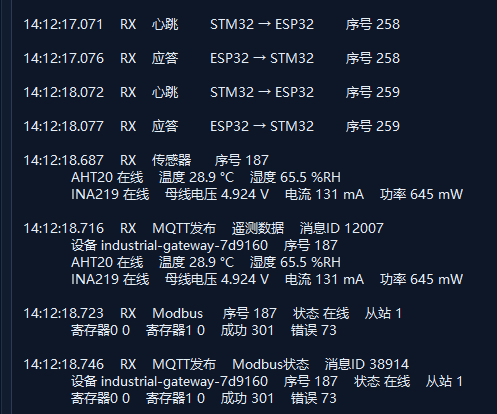

# 实验记录 v1.3：STM32—ESP32 ACK回传断线故障注入

## 实验日期

2026-08-09

## 实验目的

通过主动断开ESP32到STM32的ACK回传信号线，验证双板UART协议在单向链路故障下能否表现出以下行为：

1. STM32到ESP32的心跳发送方向仍然工作；
2. STM32因收不到匹配ACK而对同一序号进行超时重传；
3. OLED能够提示ESP链路离线；
4. 恢复线路后，链路无需修改程序即可恢复正常序号递增。

## 实验配置

- STM32与ESP32串口：115200、8N1；
- 心跳周期：约1秒；
- ACK等待时间：500毫秒；
- 最大重传次数：3次；
- 断开的线路：`STM32 PA3 ← ESP32 GPIO17`；
- 保留的发送线路：`STM32 PA2 → ESP32 GPIO16`；
- 故障持续时间：约1分钟；
- 观察工具：Qt上位机通信日志、STM32本地OLED。

## 操作过程

1. 保持完整接线运行，确认心跳序号按约1秒递增，并且每个心跳都有同序号ACK；
2. 只断开ESP32 GPIO17到STM32 PA3的ACK回传线路；
3. 保持故障约1分钟，观察Qt日志和OLED；
4. 重新接回ACK线路；
5. 继续观察序号和ACK是否恢复正常。

## 测试记录

### 1. 正常状态

断线前，Qt日志可见序号104、105、106依次递增，心跳后均出现相同序号的ACK：



这证明实验开始时双向UART链路处于可用状态。

### 2. ACK回传线路断开

断开GPIO17到PA3后，Qt日志连续出现相同心跳序号185：

```text
14:09:34.701  心跳  STM32 → ESP32  序号185
14:09:34.719  应答  ESP32 → STM32  序号185
14:09:35.133  心跳  STM32 → ESP32  序号185
14:09:35.149  应答  ESP32 → STM32  序号185
14:09:35.656  心跳  STM32 → ESP32  序号185
14:09:35.656  应答  ESP32 → STM32  序号185
```



相邻心跳间隔约0.43～0.52秒，与500毫秒ACK超时重传策略相符。日志中的“应答 ESP32→STM32”表示ESP32程序执行了ACK发送，并不表示断线后的STM32物理引脚实际收到了ACK。STM32没有收到匹配ACK，因此继续发送相同序号。

断线期间，OLED本地巡检页显示ESP链路离线，传感器与其他本地状态仍可显示：



OLED中的`TO`为累计超时统计。本组材料没有保存断线前后紧邻的两个计数特写，因此本记录不根据照片计算本次精确新增的超时次数。

### 3. 恢复ACK线路

重新连接GPIO17到PA3后，Qt日志显示：

```text
14:12:17.071  心跳  STM32 → ESP32  序号258
14:12:17.076  应答  ESP32 → STM32  序号258
14:12:18.072  心跳  STM32 → ESP32  序号259
14:12:18.077  应答  ESP32 → STM32  序号259
```



恢复后相邻新序号间隔约1秒，ACK延迟约5毫秒，链路回到正常工作状态。

## 证据链分析

### 现象

断开ACK回传线路后，同一个心跳序号以约500毫秒间隔重复；OLED显示ESP离线。

### 假设

STM32到ESP32的发送方向仍然正常，但ESP32到STM32的ACK物理回传方向断开，导致STM32的等待ACK状态机超时。

### 验证

1. ESP32日志能持续打印STM32心跳，证明STM32→ESP32方向仍通；
2. ESP32对每个重复心跳仍执行同序号ACK发送；
3. STM32继续重发相同序号，说明它没有收到匹配ACK；
4. 接回线路后序号恢复每秒递增，说明故障与回传线路状态相关。

### 结论

本次故障注入实验通过。双板协议能够在ACK回传链路断开时进入同序号超时重传，并在物理线路恢复后自动回到正常心跳/ACK过程。

### 复盘

- “ESP32打印ACK发送”与“STM32收到ACK”是两个不同事实，不能混为一谈；
- 同一序号重复可用于区分“新一轮心跳”与“上一轮请求重传”；
- OLED适合现场快速确认链路状态，Qt日志适合查看序号和时间间隔；
- 本次实验只验证STM32—ESP32 ACK回传故障。截图中出现的Modbus寄存器值和历史错误计数不作为本实验的判定依据。
