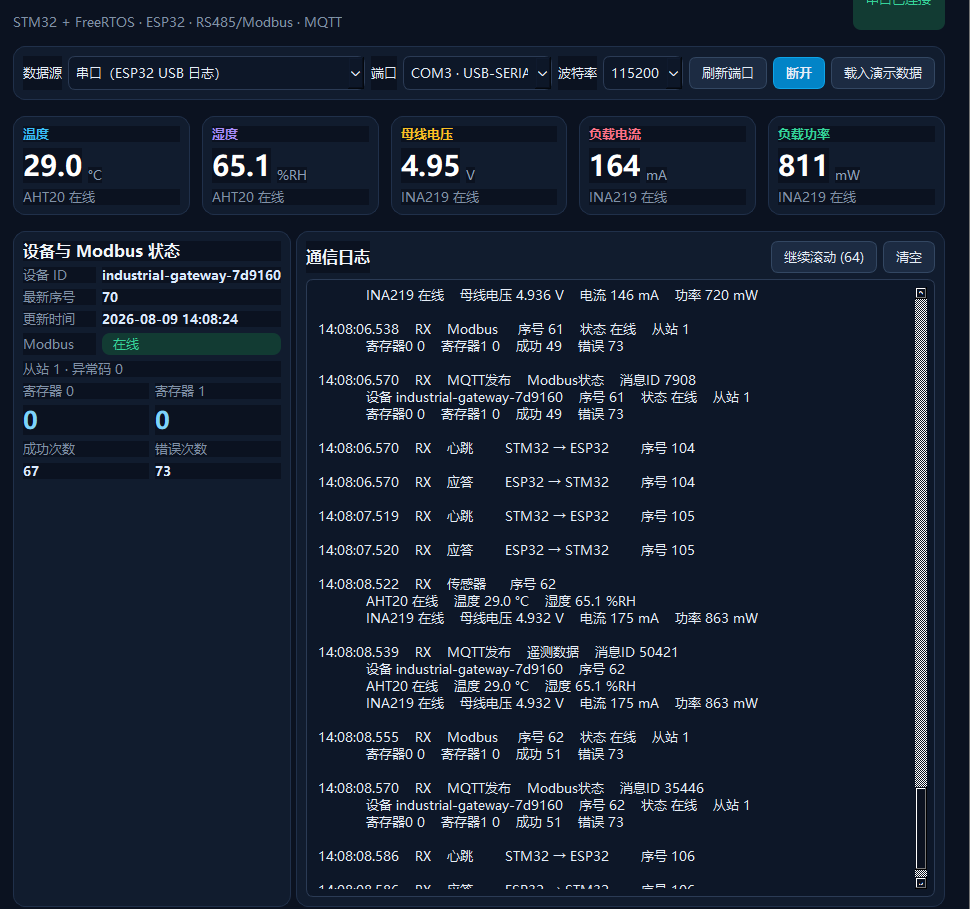
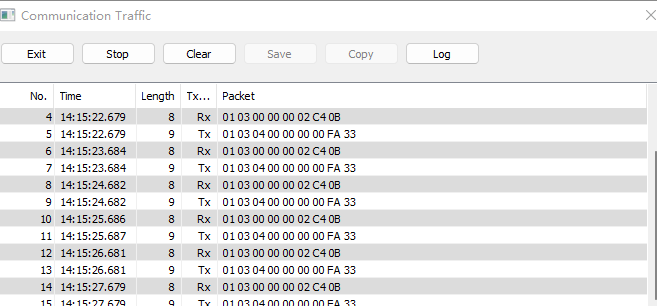
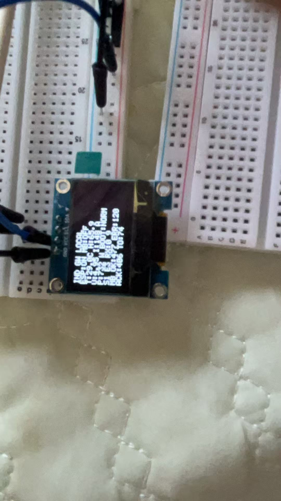
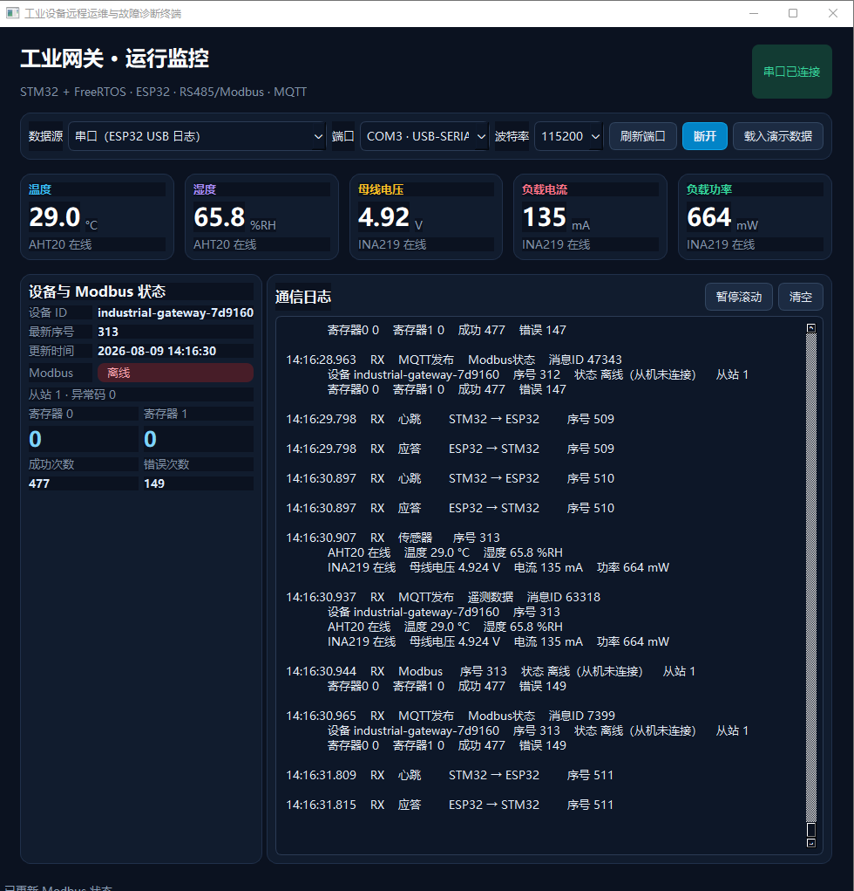
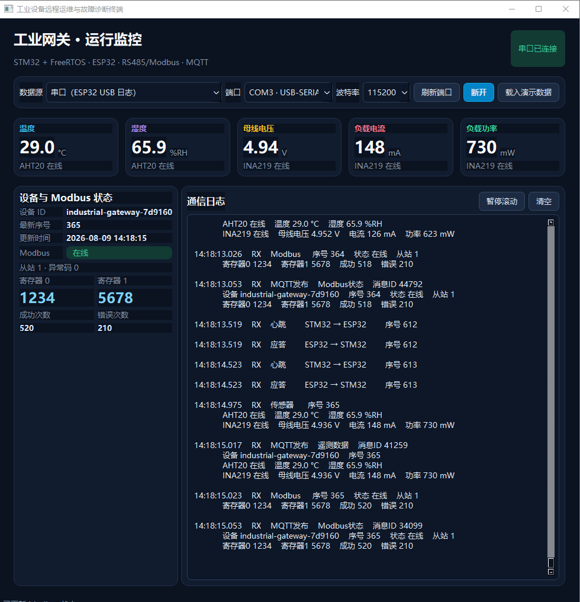

# 实验记录 v1.4：Modbus接收链路断线与自动恢复

## 实验日期

2026-08-09

## 实验目的

对STM32的Modbus RTU接收支路进行故障注入，验证以下行为：

1. 断开从站响应返回STM32的线路后，电脑从站仍能收到STM32发出的查询并发送响应；
2. STM32因收不到从站响应而累计通信错误，并最终将Modbus状态判定为离线；
3. Modbus故障不会阻塞AHT20、INA219及STM32—ESP32心跳链路；
4. 恢复接线后，系统能够自动重新读取寄存器0和寄存器1，无需重新烧录程序。

## 实验配置

- 主站：STM32F103C8T6 + FreeRTOS；
- 从站：电脑端Modbus Slave，地址1；
- 协议：Modbus RTU，功能码`03`；
- 串口参数：9600、8N1；
- 读取范围：保持寄存器0开始，连续读取2个寄存器；
- 正常寄存器值：寄存器0=`1234`，寄存器1=`5678`；
- RS485方向控制：STM32 PB1；
- 故障注入点：断开`RS485模块 TXD → STM32 PA10`，保留STM32发送方向、A/B总线和公共地；
- 观察工具：Qt上位机、电脑端Modbus Slave通信流量窗口、STM32本地OLED。

## 操作过程

1. 启动STM32、ESP32、Qt上位机和电脑端Modbus Slave；
2. 确认传感器采集、双板心跳和Modbus轮询任务正在运行；
3. 断开RS485模块TXD到STM32 PA10的接收线；
4. 观察电脑从站的请求/响应报文、Qt的Modbus状态和OLED本地状态；
5. 重新接回TXD到PA10；
6. 确认Qt恢复显示寄存器`1234/5678`，Modbus状态重新变为在线。

## 测试记录

### 证据1：系统其他链路保持运行

Qt上位机显示AHT20、INA219和STM32—ESP32心跳仍持续更新，说明故障注入没有造成整个系统停机。



这张图中的Modbus寄存器为0，且错误计数包含此前累计值，因此只用于证明传感器与双板心跳任务仍在运行，不作为正常寄存器值的验收依据。

### 证据2：电脑从站仍收到查询并发出响应

电脑端Modbus Slave通信流量窗口持续出现成对报文：

```text
Rx  01 03 00 00 00 02 C4 0B
Tx  01 03 04 00 00 00 00 FA 33
```



其中`Rx`表示电脑从站收到了STM32主站的功能码03查询，`Tx`表示电脑从站执行了响应发送。这证明STM32到从站的发送方向及电脑从站程序仍正常。

### 证据3：OLED给出本地故障状态

断线期间，OLED本地巡检页面显示Modbus异常/离线信息，同时ESP链路及本地数据页面仍可工作。



OLED用于现场快速判断故障域：主控仍在运行，但Modbus接收链路异常。

### 证据4：Qt判定Modbus离线

故障期间Qt上位机明确显示：

- Modbus：离线；
- 状态说明：从机未连接；
- 寄存器0、寄存器1：均为0；
- 成功次数：477；
- 错误次数：149。



与此同时，温湿度、电压、电流、功率以及STM32—ESP32心跳仍在刷新，说明FreeRTOS下各任务之间具有故障隔离，Modbus超时没有阻塞其他业务任务。

### 证据5：恢复接线后自动恢复

重新接回RS485模块TXD到STM32 PA10后，Qt上位机显示：

- Modbus：在线；
- 寄存器0：1234；
- 寄存器1：5678；
- 成功次数继续增加到520；
- 历史错误次数保留为累计值210。



错误计数没有在恢复时清零是预期行为：它用于保存本次运行期间累计发生过的异常；在线状态、有效寄存器值和重新增长的成功计数共同证明通信已经恢复。

本实验未提供“证据6”。现有五份材料已经覆盖故障前运行条件、从站报文、现场显示、故障判定和恢复结果，不影响实验结论。

## 证据链分析

### 现象

电脑从站仍能收到查询并发出响应，但STM32侧寄存器变为无效值，错误次数增加，Qt与OLED提示Modbus离线。

### 假设

STM32发送方向正常，而从站响应返回STM32的接收支路中断，导致主站在超时时间内收不到有效响应。

### 验证

1. 电脑从站的`Rx/Tx`成对出现，证明主站请求已到达且从站确实发送了响应；
2. STM32侧错误计数增加并判定离线，证明响应没有进入主站接收处理链路；
3. 其他传感器和心跳任务持续运行，排除了整机死机或总电源中断；
4. 仅恢复接收线后寄存器`1234/5678`和在线状态自动恢复，进一步确认故障点位于Modbus接收链路。

### 结论

本次故障注入实验通过。STM32主站能够识别Modbus接收链路断线、累计错误并上报离线状态；故障不会阻塞其他FreeRTOS任务；物理线路恢复后，主站能够自动重新轮询并恢复有效寄存器数据。

## 复盘

- “电脑从站已经发送响应”不等于“STM32已经收到响应”，必须同时观察总线两端证据；
- 通过只断开接收支路而保留发送支路，可以把故障范围从完整RS485总线缩小到单向接收链路；
- Qt适合查看状态变化、寄存器值和累计计数，OLED适合脱离电脑进行现场快速诊断；
- 错误计数是累计诊断量，恢复通信后不应自动归零；
- 五份有效证据已经形成闭环，没有必要为了数量额外补一份重复截图。

## 面试表达简版

> 我在Modbus RTU链路上做过一次单向断线故障注入：只断开RS485模块TXD到STM32 PA10的接收线，保留主站发送方向。电脑从站的流量窗口仍能看到查询请求并执行响应发送，但STM32侧错误计数持续增加，Qt和OLED都把Modbus标记为离线，同时温湿度、电参量和双板心跳任务仍正常运行。接回接收线后，系统无需复位或重新烧录就自动恢复在线，并重新读到寄存器1234和5678。这说明我不是只看“通信失败”这个结果，而是通过两端日志和单向断线把故障定位到了主站接收链路。
