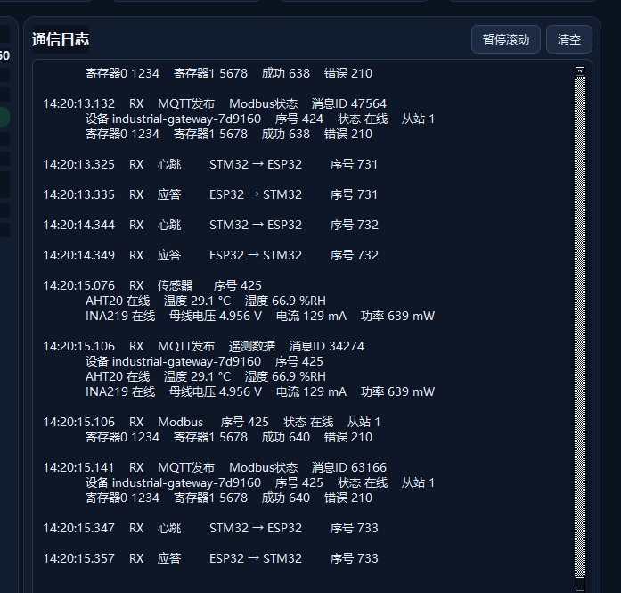
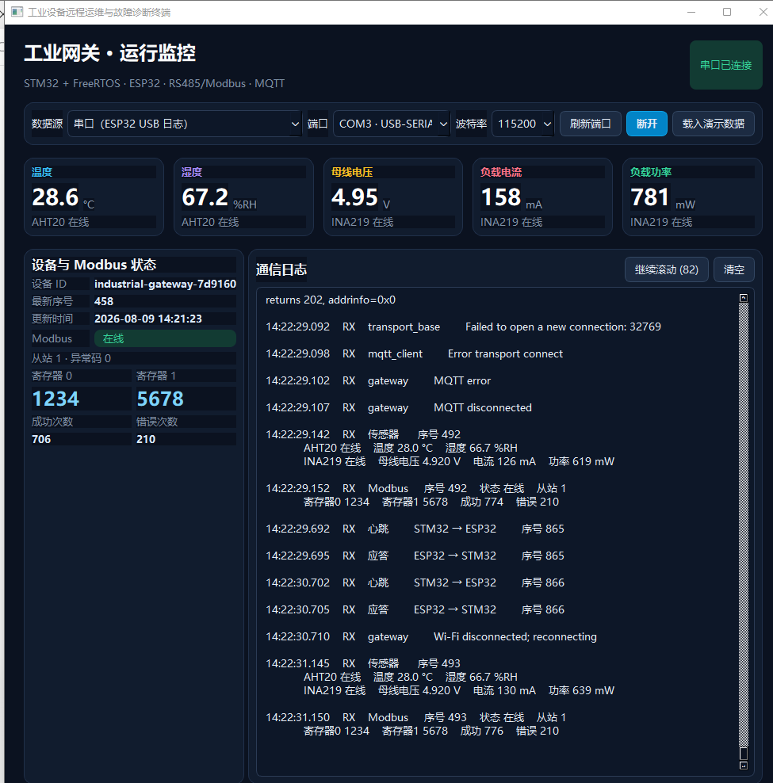
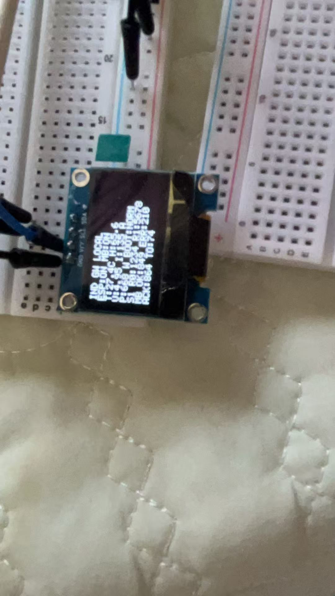
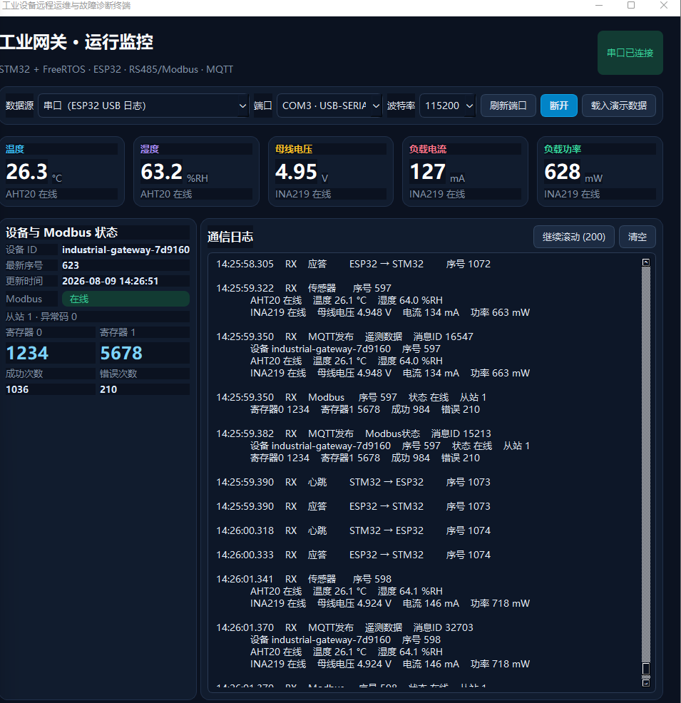

# 实验记录 v1.5：Wi-Fi/MQTT断线与自动重连

## 实验日期

2026-08-09

## 实验目的

主动中断ESP32的网络链路约3分钟，验证工业网关在网络和MQTT不可用时的降级运行与自动恢复能力：

1. ESP32能够检测Wi-Fi和MQTT连接异常并输出明确日志；
2. 网络故障不会阻塞STM32—ESP32心跳、AHT20、INA219和Modbus任务；
3. OLED仍能提供本地运行状态；
4. 网络恢复后，ESP32无需重新烧录或人工复位即可恢复MQTT遥测发布。

## 实验配置

- 本地主控：STM32F103C8T6 + FreeRTOS；
- 网络侧：ESP32-WROOM-32；
- 上位机：Qt 6串口监控界面；
- 云通信：Wi-Fi + MQTT；
- 本地业务：AHT20、INA219、Modbus RTU、STM32—ESP32 UART心跳/ACK；
- 故障方式：中断网络/Wi-Fi链路；
- 故障持续时间：约3分钟；
- 恢复方式：恢复原网络条件，不复位STM32或ESP32。

## 操作过程

1. 在Qt上位机中确认遥测MQTT发布、本地传感器、Modbus和心跳均正常；
2. 中断ESP32所使用的网络/Wi-Fi链路；
3. 保持故障约3分钟，观察Qt通信日志和OLED；
4. 恢复网络条件；
5. 继续观察MQTT发布是否自动恢复，同时确认本地任务未发生重启或中断。

## 测试记录

### 1. 断网前状态

故障注入前，Qt通信日志可见：

- MQTT持续发布遥测数据和Modbus状态；
- Modbus在线，寄存器0=`1234`、寄存器1=`5678`；
- AHT20与INA219在线；
- STM32心跳与ESP32应答序号一致并持续递增。



该截图建立了故障注入前的正常基线。

### 2. 网络与MQTT连接中断

网络中断期间，Qt日志明确出现：

```text
transport_base  Failed to open a new connection: 32769
mqtt_client     Error transport connect
gateway         MQTT error
gateway         MQTT disconnected
gateway         Wi-Fi disconnected; reconnecting
```



这些日志形成了从底层传输连接失败到MQTT断开、再到Wi-Fi重连的状态链，证明系统不是静默丢失云连接，而是能够识别并上报故障。

### 3. 网络故障期间本地任务继续运行

在同一张故障截图中仍可观察到：

- AHT20和INA219继续更新；
- Modbus保持在线并读取`1234/5678`；
- Modbus成功次数继续从此前数值增长，错误计数保持不变；
- STM32—ESP32心跳序号`865`、`866`继续递增并收到对应ACK；
- Qt与ESP32的USB串口仍保持连接。

这说明网络故障只影响云端链路，没有阻塞本地采集、现场总线或双板通信。

OLED现场页面也继续显示本地运行信息：



### 4. 网络恢复后MQTT自动恢复

恢复网络条件后，Qt日志重新出现MQTT遥测发布：

```text
MQTT发布  遥测数据  消息ID 16547
设备 industrial-gateway-7d9160  序号597
AHT20在线
INA219在线
```

同时可见Modbus在线、寄存器`1234/5678`正常，心跳序号`1073`、`1074`继续递增。



序号和累计计数连续增长，且没有重新启动后的归零现象，说明恢复过程由重连机制完成，而不是通过设备重启实现。

## 证据链分析

### 现象

中断网络后出现传输连接失败、MQTT错误、MQTT断开和Wi-Fi断开重连日志，但本地传感器、Modbus、OLED及双板心跳仍正常；恢复网络后MQTT发布自动恢复。

### 假设

故障局限于ESP32的网络/云端通信链路，系统的本地实时任务和板间UART链路不依赖MQTT连接，因此应能继续运行；网络恢复后ESP32的重连逻辑应重新建立MQTT会话。

### 验证

1. 明确的Wi-Fi和MQTT错误日志证明网络链路确实发生异常；
2. 故障期间传感器、Modbus和心跳序号继续更新，排除整机死机或电源重启；
3. OLED继续显示本地状态，证明断网时仍具备现场可观测性；
4. 网络恢复后重新出现带有效消息ID的MQTT发布，证明自动重连成功。

### 结论

本次Wi-Fi/MQTT断线故障注入实验通过。工业网关在约3分钟的网络中断期间能够保持本地采集、Modbus轮询、OLED显示和双板心跳运行；网络恢复后能够自动恢复MQTT遥测发布，无需人工复位或重新烧录。

## 复盘

- 云端离线不应等同于设备离线，本地采集与控制链路必须能够独立运行；
- 错误日志应体现“传输层失败→MQTT断开→Wi-Fi重连”的状态变化，便于快速定位故障层级；
- Qt日志用于还原时间顺序，OLED用于网络不可用时的现场巡检；
- 判断是否发生重启可以结合心跳序号、采集序号和累计计数是否连续；
- 自动恢复必须以重新出现真实MQTT发布为依据，不能只看到Wi-Fi已连接就判定云链路恢复。

## 面试表达简版

> 我还做过Wi-Fi/MQTT断线实验。我中断网络大约3分钟，日志依次出现传输连接失败、MQTT错误、MQTT断开以及Wi-Fi重连提示。但这期间AHT20、INA219、Modbus轮询和STM32—ESP32心跳都继续运行，OLED也能提供本地状态，所以我判断故障只发生在网络链路，没有扩散到实时采集任务。恢复网络后，没有复位设备，MQTT遥测就重新发布，心跳和业务序号也保持连续。这验证了系统具备断网降级运行和自动恢复能力。
