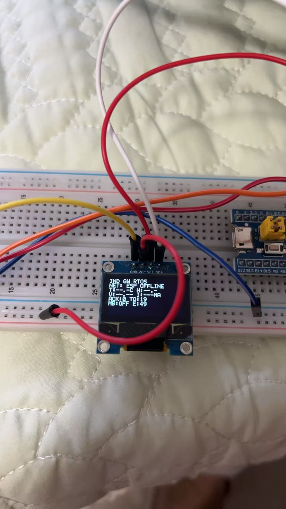
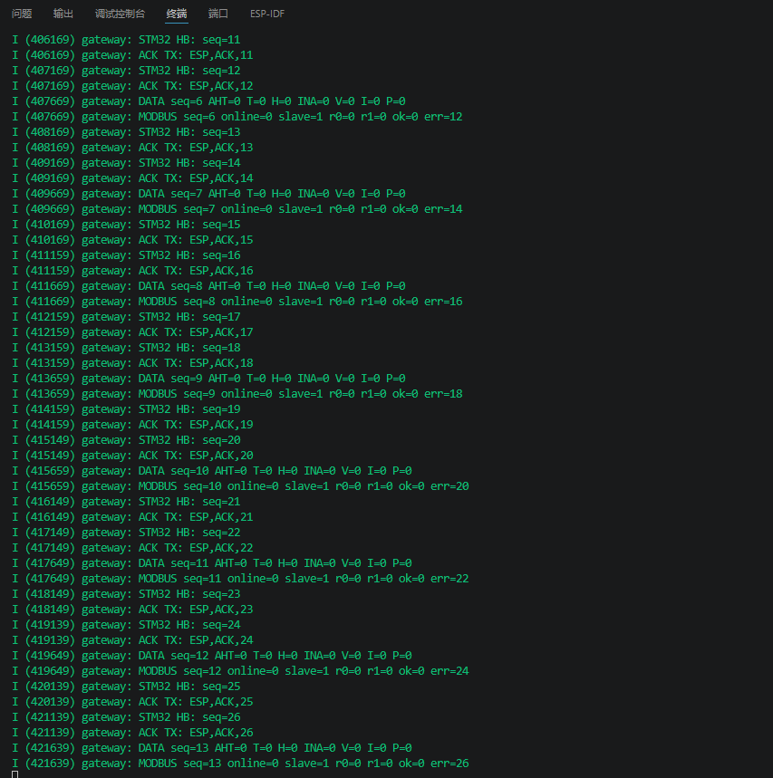
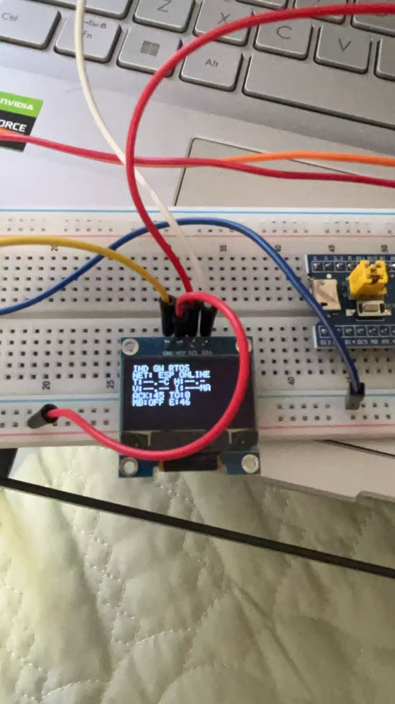
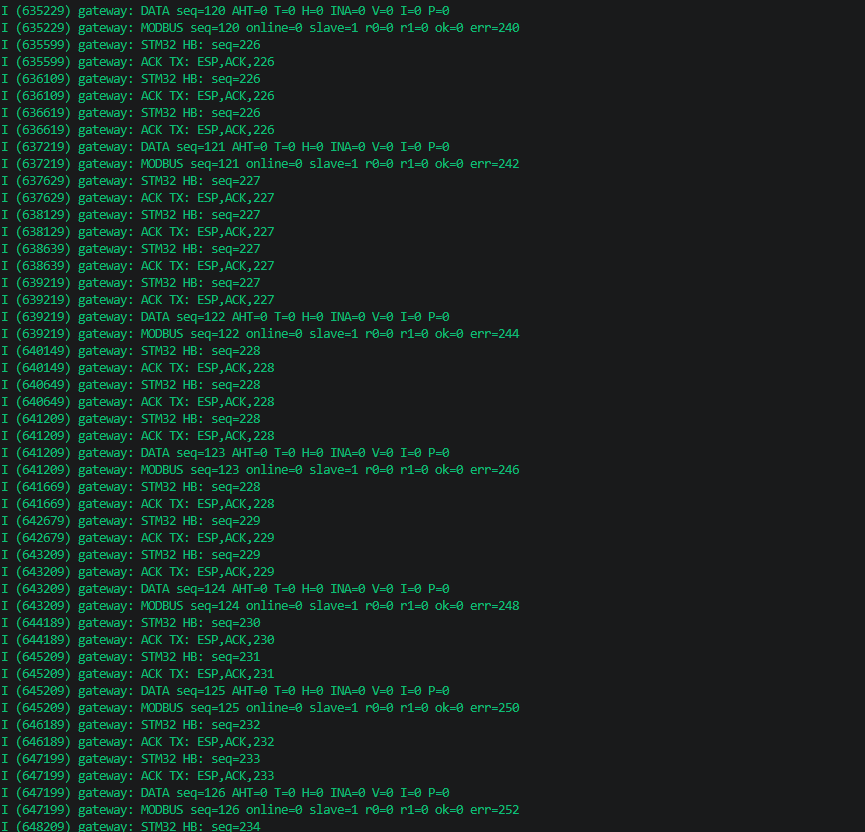
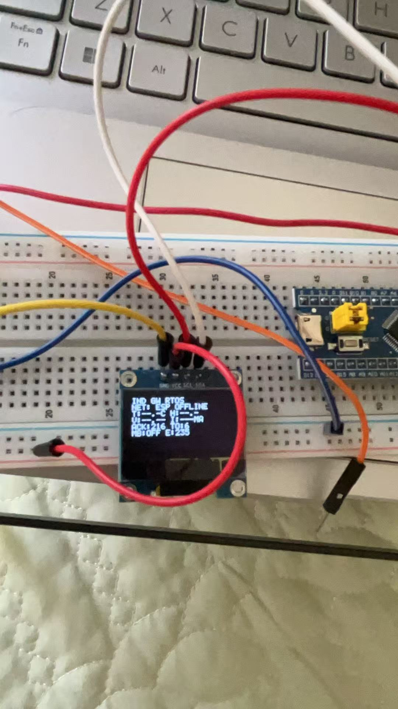
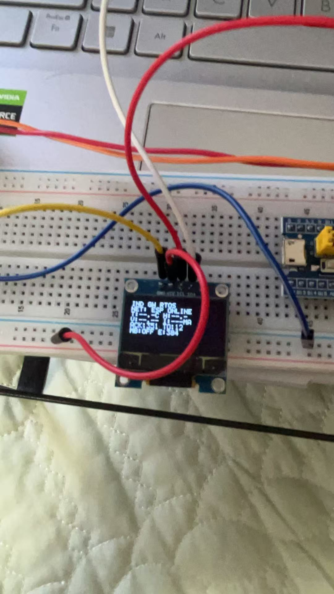
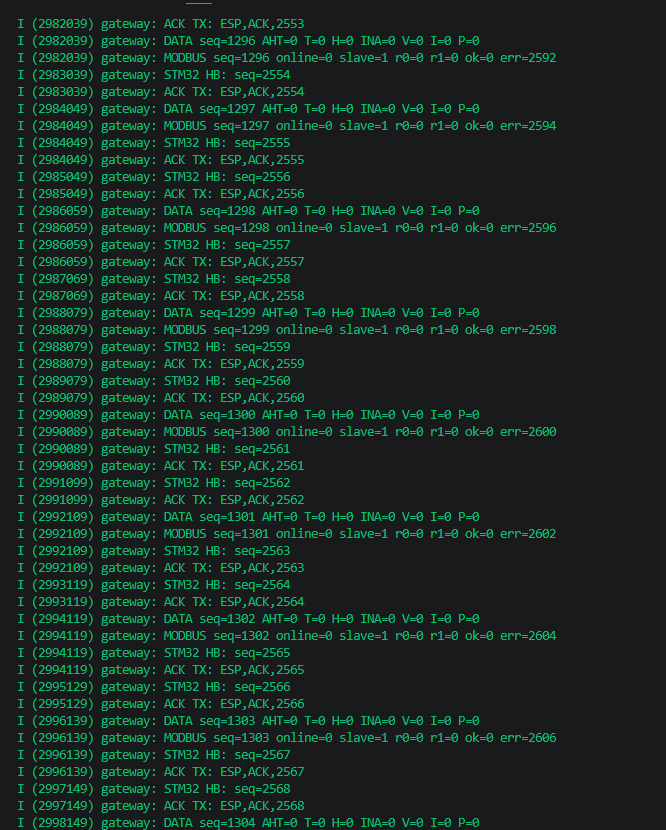
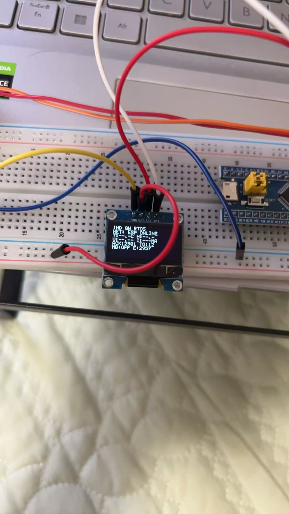

# 架构迁移 v0.5：STM32 裸机主循环迁移到 FreeRTOS

## 迁移目标

将 STM32F103C8T6 侧原先由 `while (1)` 连续调用 `App_RunOnce()` 的裸机轮询结构，迁移为抢占式 FreeRTOS 多任务结构。保留已经验证的 UART 心跳、序号 ACK、500 ms 超时与最多 3 次重传行为，同时为后续多传感器、故障诊断和工业协议接入提供清晰的任务边界。

## 任务结构

| 任务 | 优先级 | 周期 | 职责 |
|---|---:|---:|---|
| `COMM` | 高（Idle + 3） | 10 ms | 接收 ESP32 ACK、维护心跳序号、500 ms 超时重传、在线判定和 LED 状态。 |
| `SENSOR` | 中（Idle + 2） | 2000 ms | 读取 AHT20 与 INA219；硬件未到货时保留为待验证功能。 |
| `MODBUS` | 中（Idle + 2） | 1000 ms | 通过USART1/RS485轮询Modbus RTU从站。 |
| `DISPLAY` | 低（Idle + 1） | 500 ms | 获取共享状态快照并刷新 SSD1306 OLED。 |

调度器 Tick 为 1 kHz。任务间不使用全局中断屏蔽传递数据，而是采用以下同步方式：

- `s_status_mutex`：保护 ACK/超时统计、ESP32 在线状态和传感器快照。
- `s_i2c_mutex`：保证 AHT20、INA219 与 OLED 不会同时占用 I2C1。
- UART 协议状态只由 `COMM` 任务拥有，避免多个任务同时修改序号和重传状态。

## 内核与资源配置

- FreeRTOS Kernel 来源：本机已安装的 `STM32Cube_FW_F1_V1.8.6`，必要源码已保存到项目的 `Middlewares/Third_Party/FreeRTOS`。
- Cortex-M3 端口：`portable/RVDS/ARM_CM3`，适配 Keil ARM Compiler 5。
- 堆管理：`heap_4.c`，FreeRTOS 堆大小 8 KiB。
- 栈保护：启用 `configCHECK_FOR_STACK_OVERFLOW=2`。
- 动态分配失败：启用 `vApplicationMallocFailedHook()`。

## 中断衔接

- `SVC_Handler` 与 `PendSV_Handler` 由 FreeRTOS Cortex-M3 端口提供。
- `SysTick_Handler` 继续调用 `HAL_IncTick()` 维持 HAL 毫秒时基；调度器启动后同时调用 `xPortSysTickHandler()`。
- STM32 主函数完成 HAL、GPIO、I2C、UART 和任务初始化后调用 `vTaskStartScheduler()`；裸机 `App_RunOnce()` 已移除。

## 软件构建记录

构建日期：2026-07-19。

使用 Keil μVision V5.43 / ARM Compiler V5.06 update 6 对完整工程执行重新构建，结果如下：

```text
Program Size: Code=18820 RO-data=864 RW-data=128 ZI-data=11280
0 Error(s), 0 Warning(s)
```

该结果证明 FreeRTOS 内核、Cortex-M3 端口、四个应用任务、互斥锁及现有驱动已经通过链接。编译通过不等同于硬件运行验证。

## CubeMX 再生成注意事项

本次 FreeRTOS 采用“内核源码随仓库保存、Keil 工程直接集成”的方式，当前 `industrial_gateway.ioc` 仍只负责 GPIO、I2C、UART 和时钟等外设配置。此时直接在 CubeMX 点击 Generate Code 可能重写 `.uvprojx`，从 Keil 工程文件中移除手工加入的 FreeRTOS 源文件组和头文件路径。

实机回归完成前不要用 CubeMX 重新生成工程。如以后必须修改引脚或时钟，应先备份 `.uvprojx`，生成后重新加入 `Middlewares/FreeRTOS` 组及以下头文件路径，再执行一次完整构建：

```text
../Middlewares/Third_Party/FreeRTOS/Source/include
../Middlewares/Third_Party/FreeRTOS/Source/portable/RVDS/ARM_CM3
```

## 硬件回归验证

1. Keil 打开 `MDK-ARM/industrial_gateway.uvprojx`，F7 编译、F8 下载 STM32。
2. ESP32 代码未改变，无需重复烧录；如确需重刷，使用 VS Code 总命令 `ESP-IDF: Build, Flash and Monitor your Device`。
3. ESP32 Monitor 应继续显示每约 1 s 一个递增的 `STM32 HB: seq=N`，并发送同序号 ACK。
4. 断开 PA3 -> GPIO17，确认同一序号以约 500 ms 间隔出现 4 次；接回后恢复每约 1 s 递增。
5. OLED 应显示 `IND GW RTOS`、ESP 在线状态、传感器占位符（硬件未到货时）以及 ACK/TO 统计。
6. 连续运行建议不少于 30 分钟，确认无复位、卡死、ACK 丢失或 OLED 停止刷新。

### 实机启动记录（2026-07-21）



本次将 FreeRTOS 版固件下载到 STM32F103C8T6，并使用已接入 I2C1 的 SSD1306 OLED 观察运行状态。照片中可识别到：

```text
IND GW RTOS
NET: ESP OFFLINE
T:--.-C H:--.-
V:--.-- I:---MA
ACK:0 TO:19
MB:OFF E:49
```

各行含义和判定如下：

| OLED 内容 | 解释与判定 |
|---|---|
| `IND GW RTOS` | FreeRTOS 版应用已启动，`DISPLAY` 任务能够通过 I2C 刷新 OLED。 |
| `NET: ESP OFFLINE` | 拍照时未建立有效 ESP32 ACK 链路；这是当前接线/运行状态，不是 OLED 或 RTOS 故障。 |
| `T/H`、`V/I` 为 `--` | AHT20 与 INA219 尚未接入，程序按设计显示占位符。 |
| `ACK:0 TO:19` | 尚未收到匹配 ACK；超时计数已经增长，证明 `COMM` 任务正在执行链路超时处理。 |
| `MB:OFF E:49` | 尚未接入 MAX3485 和 Modbus 从站；错误计数已经增长，证明 `MODBUS` 任务正在周期轮询。 |

照片能够证明 STM32 已运行 FreeRTOS 固件，且 `DISPLAY`、`COMM`、`MODBUS` 三个任务均产生了符合当前硬件条件的可观察结果。由于本次没有提供连续运行时长、ESP32 Monitor 日志和在线状态照片，本记录不判定 UART/ACK 回归及 30 分钟稳定性通过。

### UART ACK 接收修正（2026-07-21）

FreeRTOS 实机联调时，ESP32 Monitor 显示每次均已发送 `ESP,ACK,<seq>`，但 STM32 仍以约 500 ms 间隔重复同一心跳序号。日志证明 STM32 至 ESP32 的发送路径正常，而 STM32 没有完成 ACK 接收。

检查发现，迁移后的 `COMM` 任务每 10 ms 才使用一次零超时、单字节的阻塞式 `HAL_UART_Receive()`。在 115200 bit/s 下，一帧 ACK 约 1 ms 即发送完成；任务休眠期间 USART2 来不及逐字节取走数据，可能产生接收溢出，导致始终无法拼成完整 ACK。

修正内容：

- USART2 启用接收中断；
- 中断回调逐字节写入 64 字节环形缓冲区，并立即重新挂接下一字节接收；
- `COMM` 任务从环形缓冲区取数据并继续使用原有行协议解析；
- UART 溢出错误回调清除错误并恢复中断接收。

修正后使用 Keil 完整重新构建：

```text
Program Size: Code=20188 RO-data=864 RW-data=136 ZI-data=11344
0 Error(s), 0 Warning(s)
```

该记录只证明问题定位、软件修正和构建通过；匹配 ACK、在线状态及重传恢复仍以重新下载后的实机日志为准。

### UART 在线回归记录（2026-07-21）

将中断接收修正版固件下载到 STM32 后，保持 PA2→GPIO16、PA3←GPIO17及公共 GND 接线，ESP32 Monitor 得到以下结果：



截图中 STM32 心跳序号从 `11` 连续增长到 `26`，相邻心跳时间戳约相差 1000 ms；ESP32对每一帧都发送相同序号的 ACK，例如：

```text
I (406169) gateway: STM32 HB: seq=11
I (406169) gateway: ACK TX: ESP,ACK,11
I (407169) gateway: STM32 HB: seq=12
I (407169) gateway: ACK TX: ESP,ACK,12
```

同一心跳序号不再以 500 ms 间隔重复，证明 STM32 已收到并识别匹配 ACK，中断接收与环形缓冲修正有效。Monitor还正常解析了周期性 `DATA` 和 `MODBUS` 帧；`AHT=0`、`INA=0`、`online=0` 是相应硬件尚未接入的预期结果。



OLED显示 `NET: ESP ONLINE`、`ACK:45 TO:0`，与Monitor的逐帧ACK现象一致。`MB:OFF E:46`表示没有接入RS485收发器和Modbus从站，不影响本次UART在线判定。

本次判定：**FreeRTOS版 STM32↔ESP32 正常在线通信和匹配 ACK 回归通过。** 断开PA3后的重传及重新接线恢复仍需基于修正版固件再执行一次。

### 断线重传与恢复记录（2026-07-21）

保持 STM32→ESP32 的 PA2/GPIO16 发送路径及公共 GND 不变，在系统运行时断开 ESP32 GPIO17→STM32 PA3 的 ACK 回传线，然后重新接回。



Monitor中可观察到：

```text
I (637629) gateway: STM32 HB: seq=227
I (638129) gateway: STM32 HB: seq=227
I (638639) gateway: STM32 HB: seq=227
I (639219) gateway: STM32 HB: seq=227

I (640149) gateway: STM32 HB: seq=228
I (640649) gateway: STM32 HB: seq=228
I (641209) gateway: STM32 HB: seq=228
I (641669) gateway: STM32 HB: seq=228
```

同一序号均出现4次，对应“首次发送 + 最多3次重传”；相邻时间约为500～580 ms，与500 ms超时配置及FreeRTOS任务调度误差相符。ESP32仍能收到STM32心跳并发送ACK，但回传线断开，因此STM32无法接收ACK。

接回PA3后，Monitor后段恢复为：

```text
I (644189) gateway: STM32 HB: seq=230
I (645209) gateway: STM32 HB: seq=231
I (646189) gateway: STM32 HB: seq=232
I (647199) gateway: STM32 HB: seq=233
I (648209) gateway: STM32 HB: seq=234
```

序号重新约每1秒递增，证明回传链路恢复后STM32能够再次接收匹配ACK并退出重传状态。



断线阶段OLED显示 `NET: ESP OFFLINE`，且 `TO` 计数增加，符合链路离线判定。



接回后OLED恢复显示 `NET: ESP ONLINE`；累计超时计数被保留，便于诊断历史断线事件。传感器占位符和 `MB:OFF` 仍是相关硬件未接入的预期状态。

本次判定：**FreeRTOS版500 ms超时、最多3次重传、离线显示及重新接线后的自动恢复全部通过。**

### 连续运行稳定性记录（2026-07-21）

完成断线恢复后保持接线、供电和Monitor连续运行，未重新烧录或复位。前一组恢复证据记录到 `648209 ms、seq=234`，本次证据记录到 `2997149 ms、seq=2568`：



两次证据之间的连续运行跨度为：

```text
2997149 ms - 648209 ms = 2348940 ms ≈ 39 min 09 s
2568 - 234 = 2334 个心跳序号
```

约39分钟内心跳序号增加2334，与每秒一次的设计周期一致；末段 `seq=2553～2568`仍连续递增并逐帧ACK。周期性 `DATA` 与 `MODBUS` 帧也持续输出，没有发现ESP32重新启动日志、序号回退或任务停止。



OLED在连续运行后仍正常刷新并显示 `NET: ESP ONLINE`。`ACK`已累计到约2901，`TO:2`保留了此前人工断开PA3产生的历史超时；当前在线状态和连续心跳表明恢复后没有持续通信故障。`MB:OFF`及传感器占位符仍符合未接入对应硬件的现状。

本次判定：**连续运行约39分钟期间未观察到复位、卡死、OLED停止刷新或UART ACK异常，超过预定30分钟稳定性要求。**

### 回归完成情况

FreeRTOS迁移阶段计划的实机启动、正常ACK、断线重传、自动恢复和30分钟稳定性检查均已完成。

## 当前结论

**FreeRTOS 软件迁移、Keil 构建、STM32 实机启动、STM32↔ESP32 在线 ACK、500 ms超时、最多3次重传、断线自动恢复及约39分钟连续运行稳定性全部通过；USART2中断接收修正已由实机验证。FreeRTOS迁移阶段正式完成。AHT20、INA219和MAX3485未接入，不纳入本次结论。**
