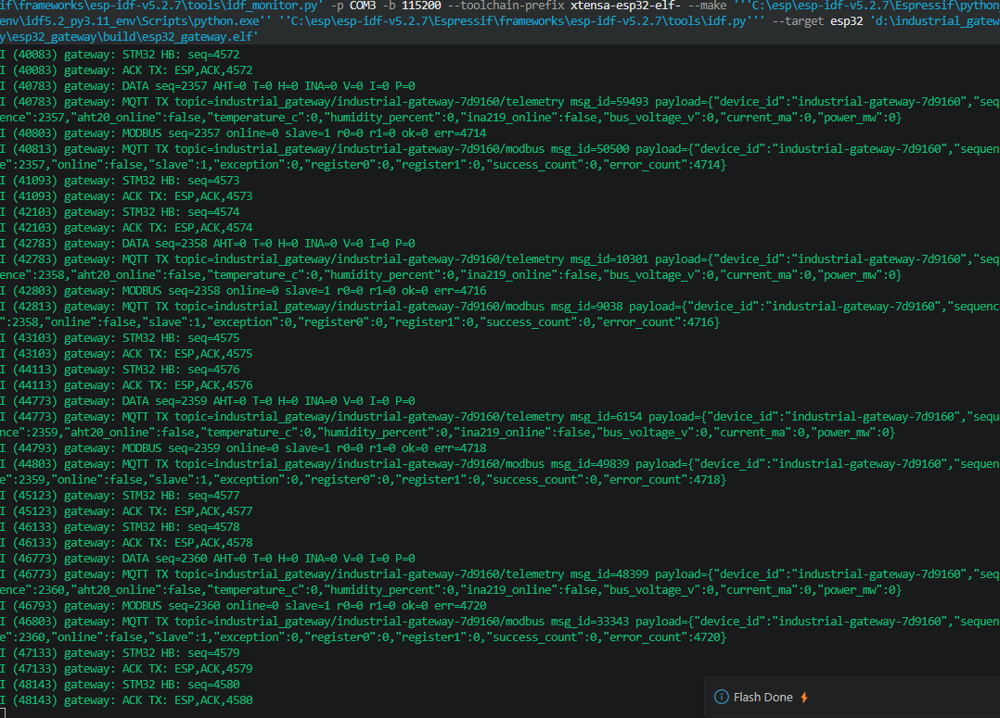
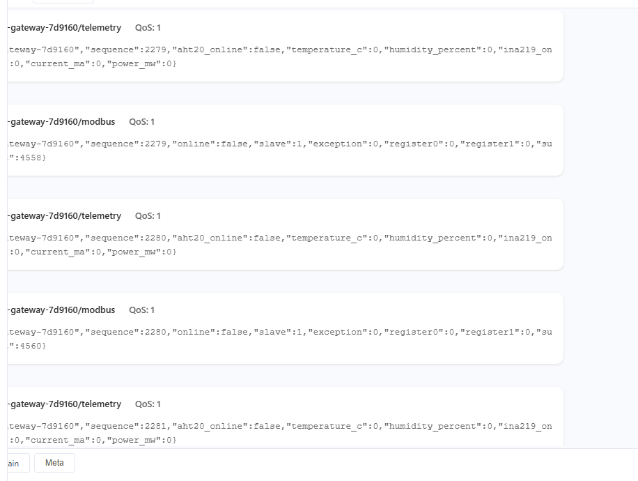

# 预备实现 v0.6：RS485/Modbus、Wi-Fi 与 MQTT

## 当前状态

本阶段代码已完成。Wi-Fi/MQTT已完成真实联网与消息接收实验；传感器和RS485部分仍等待相应硬件。

| 工程 | 构建结果 |
|---|---|
| STM32/Keil | `0 Error(s), 0 Warning(s)`；Code 20188 bytes，ZI 11344 bytes |
| ESP32/ESP-IDF | Wi-Fi版构建成功；`esp32_gateway.bin` 为 `0xdc1c0` bytes，应用分区剩余约14% |

## STM32 FreeRTOS 任务

| 任务 | 主要职责 |
|---|---|
| `COMM` | 心跳、ACK、重传、传感器/Modbus遥测帧发送 |
| `SENSOR` | AHT20、INA219采样 |
| `MODBUS` | USART1/RS485轮询从站1的保持寄存器0～1 |
| `DISPLAY` | OLED状态页 |

## RS485 接线预案

推荐使用 3.3V 的 MAX3485/SP3485。若实际购买的是 5V MAX485 模块，接线前必须确认其 RO 输出不会向 STM32 PA10输入 5V。

| RS485模块 | STM32F103C8T6 |
|---|---|
| VCC | 3.3V（仅适用于3.3V收发器） |
| GND | GND |
| DI | PA9 / USART1 TX |
| RO | PA10 / USART1 RX |
| DE 与 `/RE` 短接 | PB1 / RS485_DE |
| A、B | Modbus总线A、B |

当前参数为 9600 8N1、从站地址1、功能码03、起始寄存器0、数量2。实际测试时按从站说明书修改 `App/Src/app_main.c` 中的 `MODBUS_*` 常量。

总线两端使用120Ω终端电阻；短距离桌面单从站测试时可先按模块说明确认板载终端配置。

## ESP32 网络配置

首次联网前，在 VS Code 命令面板执行 `ESP-IDF: SDK Configuration editor (menuconfig)`，进入 `Industrial gateway network configuration` 填写网络和 Broker。密码保存在本机 `sdkconfig`，公开上传项目前应检查是否包含真实凭据。

配置后使用总命令：

```text
ESP-IDF: Build, Flash and Monitor your Device
```

本机 `sdkconfig` 已加入仓库根目录 `.gitignore`，避免Wi-Fi凭据在后续上传GitHub时被提交。

## Wi-Fi/MQTT 实机测试记录（2026-07-21）

### 测试环境

- ESP32通过2.4 GHz Wi-Fi接入互联网；
- ESP32使用MQTT TCP连接 `broker.emqx.io:1883`；
- 浏览器使用MQTTX Web，通过安全WebSocket连接 `broker.emqx.io:8084/mqtt`；
- 订阅主题：`industrial_gateway/industrial-gateway-7d9160/#`；
- MQTT QoS：1。

### ESP32 发布证据



ESP32 Monitor显示：

- STM32心跳序号 `4572～4580`连续递增，ESP32逐帧回复同序号ACK；
- `DATA`遥测序号 `2357～2360`持续递增；
- 每帧 `DATA`被转换为JSON并发布到`telemetry`主题；
- 每帧Modbus状态被转换为JSON并发布到`modbus`主题；
- MQTT发布返回有效`msg_id`，且设备保持运行。

日志中的 `aht20_online=false`、`ina219_online=false`和Modbus `online=false`与当前未接入相应硬件的状态一致，不属于网络或MQTT错误。

### 接收证据



MQTTX Web连续收到以下两类消息：

- `industrial_gateway/industrial-gateway-7d9160/telemetry`；
- `industrial_gateway/industrial-gateway-7d9160/modbus`。

截图中的消息序号由 `2279`连续增长到`2281`，证明不是单条缓存数据，而是ESP32正在周期发布。`telemetry` JSON中 `aht20_online=false`、`ina219_online=false`，`modbus` JSON中 `online=false`、`slave=1`；这些字段与AHT20、INA219和RS485从站尚未接入的实际硬件状态一致。

本次数据路径为：

```text
STM32 FreeRTOS -> USART2 -> ESP32 -> Wi-Fi -> MQTT Broker -> MQTTX Web
```

本次判定：**Wi-Fi接入、MQTT连接、QoS 1发布、公共Broker转发及浏览器订阅接收全部通过。** Wi-Fi断开后的自动重连可在后续可靠性测试中单独验证。

## 到货后的建议测试顺序

1. 先只烧录 STM32 RTOS 固件，回归 UART 心跳/ACK和超时重传。
2. 接入 AHT20，验证温湿度及 `GW,DATA`。
3. 接入 INA219，先测低压、小电流负载，并与万用表对比。
4. 接入 3.3V RS485 收发器和一个明确寄存器表的 Modbus从站，验证 CRC、方向控制和寄存器值。
5. ESP32先配置 Wi-Fi，观察获取IP与自动重连日志。
6. 启动 MQTT Broker，再验证 status、telemetry、modbus 三类Topic。
7. 每完成一项真实实验，在对应文档补充日期、日志、截图、测量值和结论。

## 待实机确认

- AHT20/INA219模块地址是否为默认值；
- INA219板载分流电阻是否为0.1Ω；
- RS485模块实际供电和逻辑电平；
- Modbus从站波特率、校验、地址和寄存器表；
- Wi-Fi断开后的自动重连与MQTT会话恢复。

**当前结论：Wi-Fi/MQTT端到端实机实验通过；AHT20、INA219和RS485/Modbus仍等待硬件测试。**
